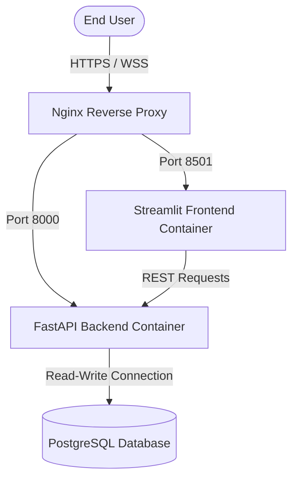

# Deployment Guide: RetainIQ Customer Retention Platform

This guide covers production deployment configurations, container orchestration, environment setup, and database migrations for the RetainIQ platform.

---

## Database Requirements 

Avoid using SQLite in production. Because SQLite relies on file-level write locking, concurrent writes from the FastAPI background worker (`process_upload_task`) and the main API handler will trigger locking exceptions (`OperationalError: database is locked`). Use PostgreSQL instead.

The platform natively supports PostgreSQL via the `DATABASE_URL` environment variable. When PostgreSQL is detected, the database engine automatically optimizes connection pool parameters (such as setting `pool_size=20`, `max_overflow=10`, and `pool_recycle=1800`) to maintain stability under high loads.

### Local Development SQLite Databases
During local development, two SQLite databases are used:
1. **`backend/customer_retention.db`**: The primary database for the FastAPI application and unit tests. It is pre-seeded with test users and sample cohorts.
2. **`customer_retention.db` (Project Root)**: Used as a fallback database by standalone preprocessing and machine learning scripts run directly from the project root.

Please do not delete or rename these files; they are referenced by distinct environments and pipeline configurations.

---

## 1. Infrastructure Topology & Container Design

The platform runs on a multi-container Docker stack comprising a FastAPI application server, a Streamlit dashboard, a PostgreSQL database, and an Nginx reverse proxy.



---

## 2. Docker Compose Configuration

Use the configured `docker-compose.yml` file located in the `docker/` folder to spin up the production stack.

```yaml
version: '3.8'

services:
  db:
    image: postgres:15-alpine
    container_name: retainiq-db
    environment:
      - POSTGRES_USER=retainiq
      - POSTGRES_PASSWORD=retainiq_secure_pass
      - POSTGRES_DB=customer_retention
    volumes:
      - pgdata:/var/lib/postgresql/data
    ports:
      - "5432:5432"
    healthcheck:
      test: ["CMD-SHELL", "pg_isready -U retainiq -d customer_retention"]
      interval: 5s
      timeout: 5s
      retries: 5
    restart: always

  backend:
    build:
      context: ..
      dockerfile: backend/Dockerfile
    container_name: retainiq-backend
    environment:
      - DATABASE_URL=postgresql://retainiq:retainiq_secure_pass@db:5432/customer_retention
      - JWT_SECRET=super-secret-key-change-in-production-1234567890
      - APP_ENV=production
      - DEBUG=False
      - ALLOWED_ORIGINS=http://localhost:8501,http://127.0.0.1:8501,https://retainiq.yourdomain.com
    volumes:
      - ../backend/logs:/app/backend/logs
    ports:
      - "8000:8000"
    depends_on:
      db:
        condition: service_healthy
    restart: always

  frontend:
    build:
      context: ..
      dockerfile: frontend/Dockerfile
    container_name: retainiq-frontend
    environment:
      - API_BASE_URL=http://backend:8000
    ports:
      - "8501:8501"
    depends_on:
      - backend
    restart: always

  nginx:
    image: nginx:alpine
    container_name: retainiq-nginx
    ports:
      - "80:80"
    volumes:
      - ./nginx.conf:/etc/nginx/nginx.conf:ro
    depends_on:
      - frontend
      - backend
    restart: always

volumes:
  pgdata:
```

---

## 3. Environment Variables Specification

Customize application behavior at startup by supplying the following variables:

### Backend Application Environment
| Variable Name | Type | Default Value | Description |
| :--- | :---: | :--- | :--- |
| `APP_ENV` | String | `development` | Deployment environment mode (`development`, `production`). |
| `DEBUG` | Boolean | `True` | Enables debug log output and verbose traceback responses. |
| `DATABASE_URL` | String | `sqlite:///./customer_retention.db` | Connection URI. Defaults to local SQLite if unset. |
| `ALLOWED_ORIGINS` | String | `http://localhost:8501,http://127.0.0.1:8501` | Comma-separated list of allowed CORS domains. |
| `JWT_SECRET` | String | (Default string) | HMAC-SHA256 signing secret. **Mandatory override in production**; server will refuse to start if default is used. |
| `ACCESS_TOKEN_EXPIRE_MINUTES` | Integer | `60` | Lifecycle duration of user auth sessions. |

### Frontend Application Environment
| Variable Name | Type | Default Value | Description |
| :--- | :---: | :--- | :--- |
| `API_BASE_URL` | String | `http://127.0.0.1:8000` | HTTP root URL of the target API container. |

---

## 4. Database Migrations (Alembic)

The codebase utilizes Alembic for tracking structural database changes.

To initialize or upgrade your production database schema:
```bash
# Run from the 'backend' folder
alembic upgrade head
```

If deploying inside Docker, run the migration inside the running backend container:
```bash
docker exec -it retainiq-backend alembic upgrade head
```

---

## 5. Reverse Proxy & WebSocket Configuration

Streamlit leverages active WebSockets for browser synchronization. When deploying behind a reverse proxy (e.g., Nginx), you must enable WebSocket upgrades:

### Nginx Configuration (`docker/nginx.conf`)
```nginx
server {
    listen 80;
    server_name localhost;

    # Backend API Routing
    location /api/ {
        proxy_pass http://backend:8000;
        proxy_set_header Host $host;
        proxy_set_header X-Real-IP $remote_addr;
        proxy_set_header X-Forwarded-For $proxy_add_x_forwarded_for;
        proxy_set_header X-Forwarded-Proto $scheme;
    }

    # Streamlit Frontend Dashboard Routing
    location / {
        proxy_pass http://frontend:8501;
        proxy_set_header Host $host;
        proxy_set_header X-Real-IP $remote_addr;
        proxy_set_header X-Forwarded-For $proxy_add_x_forwarded_for;
        proxy_set_header X-Forwarded-Proto $scheme;
        
        # Streamlit WebSocket Support
        proxy_http_version 1.1;
        proxy_set_header Upgrade $http_upgrade;
        proxy_set_header Connection "upgrade";
        proxy_read_timeout 86400;
    }
}
```

---

## 6. Security & Rate Limiting

To protect public endpoints, the backend uses a sliding-window rate limiter.
- **Upload & Explain Route Limit**: 60 requests per minute per client key (token or IP).
- **Auth Login Route Limit**: 10 requests per minute per client key (prevents brute-force credential attacks).
- **Target Paths**: `/api/v1/auth/login`, `/api/v1/upload`, `/api/v1/customers/{customer_id}/explain`.
- **Status Response**: Returns `429 Too Many Requests` with a JSON payload: `{"detail": "Too many requests. Please try again later."}`.
- **Stale Key Eviction**: The in-memory rate limiter database is pruned every 500 requests to prevent memory growth.

---

## 7. ML Artifact Retraining & CI/CD Pipeline

The platform implements a strict SHA-256 integrity verification system. If model artifacts are regenerated, `artifacts_manifest.json` must be updated, otherwise the application server will refuse to start.

### Retraining Workflow
```makefile
# Run retraining and regenerate artifact integrity signatures
retrain:
	python ml/training/train.py
	python ml/segmentation/train_autoencoder.py
	python ml/segmentation/kmeans.py
	python scripts/generate_manifest.py
```

### GitHub Actions CI/CD Skeleton
```yaml
name: Weekly Model Retrain & Deploy

on:
  workflow_dispatch:           # Manual trigger
  schedule:
    - cron: "0 2 * * 0"        # Weekly retraining on Sunday at 2 AM

jobs:
  retrain:
    runs-on: ubuntu-latest
    steps:
      - uses: actions/checkout@v4
      - name: Install dependencies
        run: pip install -r requirements.txt
      - name: Run training pipeline & signatures
        run: make retrain
      - name: Run test suite
        run: pytest tests/ -v
      - name: Build & push Docker image
        run: |
          docker build -t retainiq-backend:latest -f backend/Dockerfile .
          docker push ghcr.io/${{ github.repository }}/retainiq-backend:latest
      - name: Deploy to Production
        run: ssh deploy@prod "cd /opt/retainiq/docker && docker-compose pull && docker-compose up -d"
```

---

## 8. Execution Commands

To build and start the platform services locally or on a server:

```bash
# Set required environment secrets (or populate a .env file)
export JWT_SECRET="$(openssl rand -hex 32)"
export POSTGRES_PASSWORD="$(openssl rand -hex 16)"

# Navigate to the docker orchestration folder
cd docker

# Build and startup all services in the background
docker-compose up --build -d

# Check startup logs and health status
docker-compose logs -f

# Run database schema migrations
docker exec -it retainiq-backend alembic upgrade head

# Shutdown services and clean up network resources
docker-compose down
```
