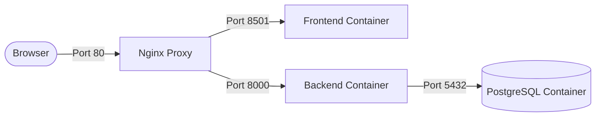
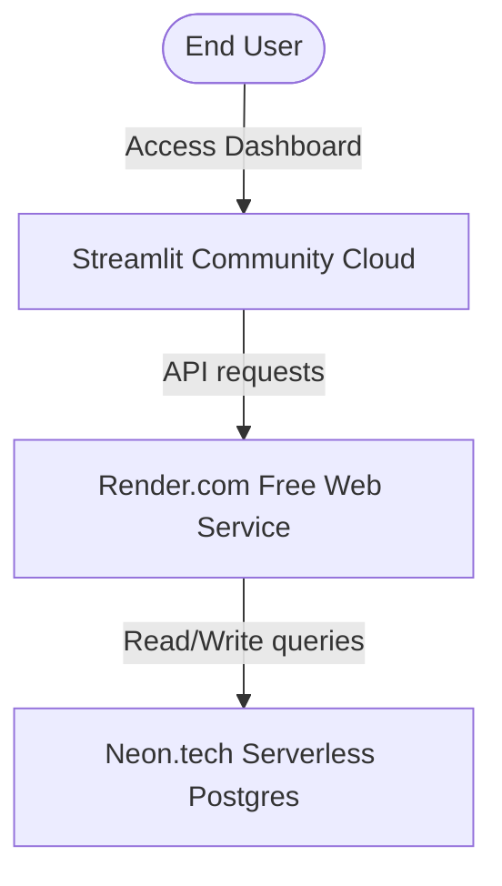

# Enterprise Deployment Roadmap: RetainIQ Platform

This roadmap provides detailed, step-by-step instructions for deploying the RetainIQ Churn Portal across two target environments: **Local Docker Compose** and a **100% Free Cloud Tier Architecture**.

---

## 📋 Pre-Deployment Checklist
Prior to starting either deployment track, ensure you have:
1. A **GitHub Account** containing a fork of this repository.
2. **Git** and **Python 3.10+** installed locally.
3. **Docker Desktop** installed (necessary for Track 1 local hosting).

---

## 🛠️ Track 1: Local Deployment (Docker Compose)
*Best for local testing, offline development, and zero-cost self-hosting.*



### Step 1.1: Start the Docker Daemon
* Open **Docker Desktop** on your computer.
* Wait until the status icon in the bottom-left corner turns green (**"Engine Running"**).

### Step 1.2: Initialize the Configuration Files
We have pre-created the `.env` configuration file in the project root folder.
* Verify the file exists and contains generated passwords:
  ```powershell
  cat .env
  ```

### Step 1.3: Start the Multi-Container Service Stack
Run the following orchestration command from the project root:
```powershell
docker compose --env-file .env -f docker/docker-compose.yml up --build -d
```
* **Nginx** handles request routing on port `80`.
* **FastAPI** executes predictions on port `8000`.
* **Streamlit** serves the UI dashboard on port `8501`.
* **PostgreSQL** runs database persistence on port `5432`.

### Step 1.4: Run Database Migrations
Since PostgreSQL starts with empty storage, run Alembic schema migrations inside the running backend container to generate tables:
```powershell
docker exec -it retainiq-backend alembic upgrade head
```

### Step 1.5: Access the Applications
Once the containers are running and healthy:
* **UI Dashboard**: Open `http://localhost/`
* **Swagger API Docs**: Open `http://localhost/docs`

---

## 🌍 Track 2: 100% Free Cloud Tier Deployment
*Best for public sharing, production demos, and remote accessibility without server costs.*



### Step 2.1: Database Provisioning (Neon.tech)
1. Go to **[Neon.tech](https://neon.tech/)** and register a free account.
2. Create a new project named `retainiq-prod`.
3. Select **PostgreSQL 15** or **16** in the configuration options.
4. Copy the connection URI string. It will look like this:
   ```text
   postgres://[user]:[password]@[host]/neondb?sslmode=require
   ```
5. Keep this connection string secure for Step 2.2.

### Step 2.2: Backend API Deployment (Render.com)
1. Register a free account on **[Render.com](https://render.com/)**.
2. Click **New +** and select **Web Service**.
3. Connect your GitHub repository containing the codebase.
4. Set the following deployment parameters:
   * **Name**: `retainiq-backend`
   * **Runtime**: `Python 3` (or choose Docker to build using `backend/Dockerfile`)
   * **Branch**: `main`
   * **Build Command**: `pip install -r requirements.txt` (or if using Docker, Render auto-builds using the Dockerfile)
   * **Start Command**: `uvicorn app.main:app --host 0.0.0.0 --port $PORT` (if deploying raw Python)
5. Navigate to **Environment** tab and click **Add Environment Variable**:
   * `DATABASE_URL`: *Your Neon connection URI (from Step 2.1)*
   * `JWT_SECRET`: *Generate a random hex value (e.g. using `openssl rand -hex 32`)*
   * `APP_ENV`: `production`
   * `DEBUG`: `False`
   * `ALLOWED_ORIGINS`: `https://[your-app-name].streamlit.app` *(Streamlit URL from Step 2.3)*
6. Click **Deploy Web Service**. Render will build and provide a public URL like `https://retainiq-backend.onrender.com`.

### Step 2.3: Frontend Dashboard Deployment (Streamlit Cloud)
1. Go to **[Streamlit Community Cloud](https://streamlit.io/cloud)** and login with GitHub.
2. Click **New app**.
3. Choose your repository, branch (`main`), and set:
   * **Main file path**: `frontend/app.py`
4. Expand **Advanced settings** (Secrets) and write the connection parameters:
   ```toml
   API_BASE_URL = "https://retainiq-backend.onrender.com"
   ```
5. Click **Deploy!** Your application will compile and open at `https://[name].streamlit.app/`.

---

## 🔒 Post-Deployment Database Initialization
Once the Render backend is live, you must run migrations to generate Postgres tables.
1. Run this command locally on your machine pointing to the Neon DB:
   ```powershell
   # In your local terminal, navigate to the 'backend' folder
   cd backend
   
   # Set the database URL target temporarily
   $env:DATABASE_URL="postgres://[user]:[password]@[host]/neondb?sslmode=require"
   
   # Apply migrations
   alembic upgrade head
   ```
2. The database is now ready to handle batches.

---

## 🚨 Operational Troubleshooting & Tips
* **Render Cold Start**: The free tier of Render sleeps after 15 minutes of inactivity. When visiting the Streamlit dashboard after a period of dormancy, the first prediction request may take 30–50 seconds to complete while the backend container wakes up.
* **Logs Inspection**:
  * **Local**: Run `docker compose -f docker/docker-compose.yml logs -f backend`.
  * **Render**: Inspect the **Logs** tab in the Render Dashboard.
