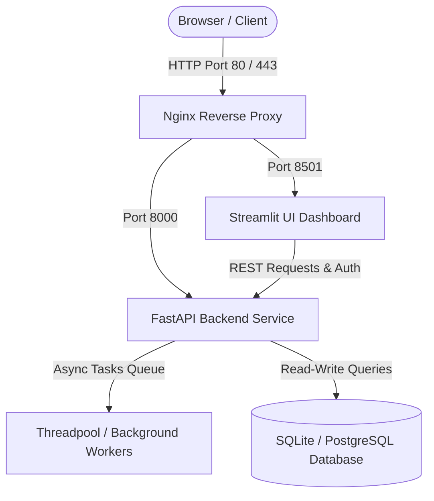
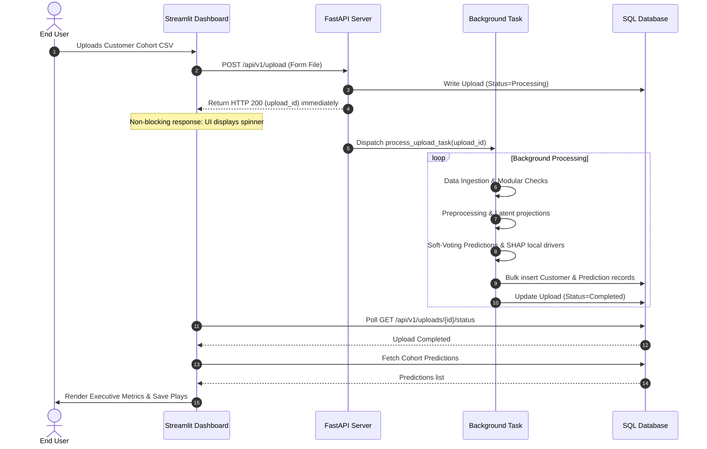
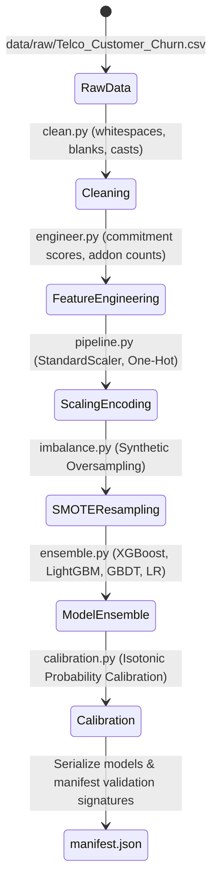
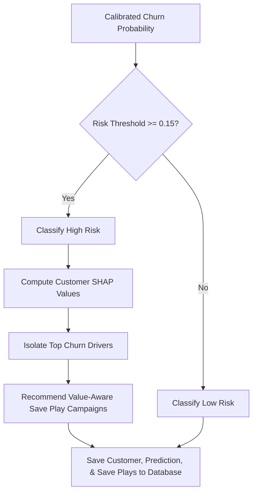
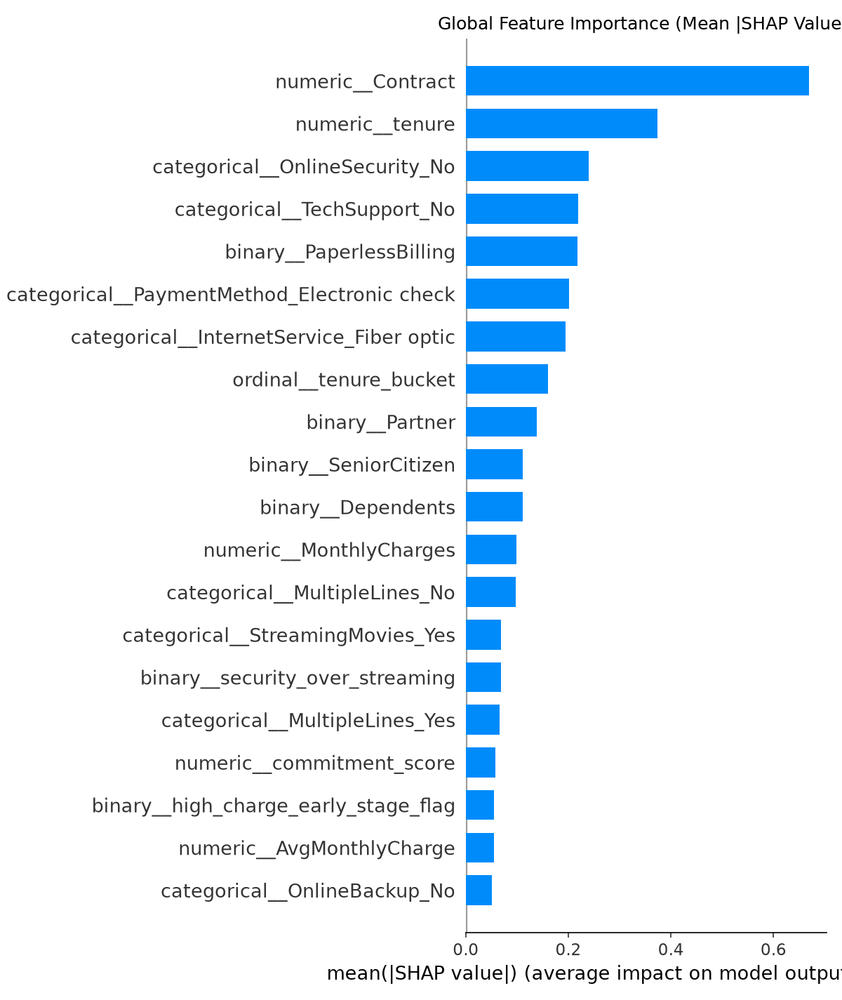
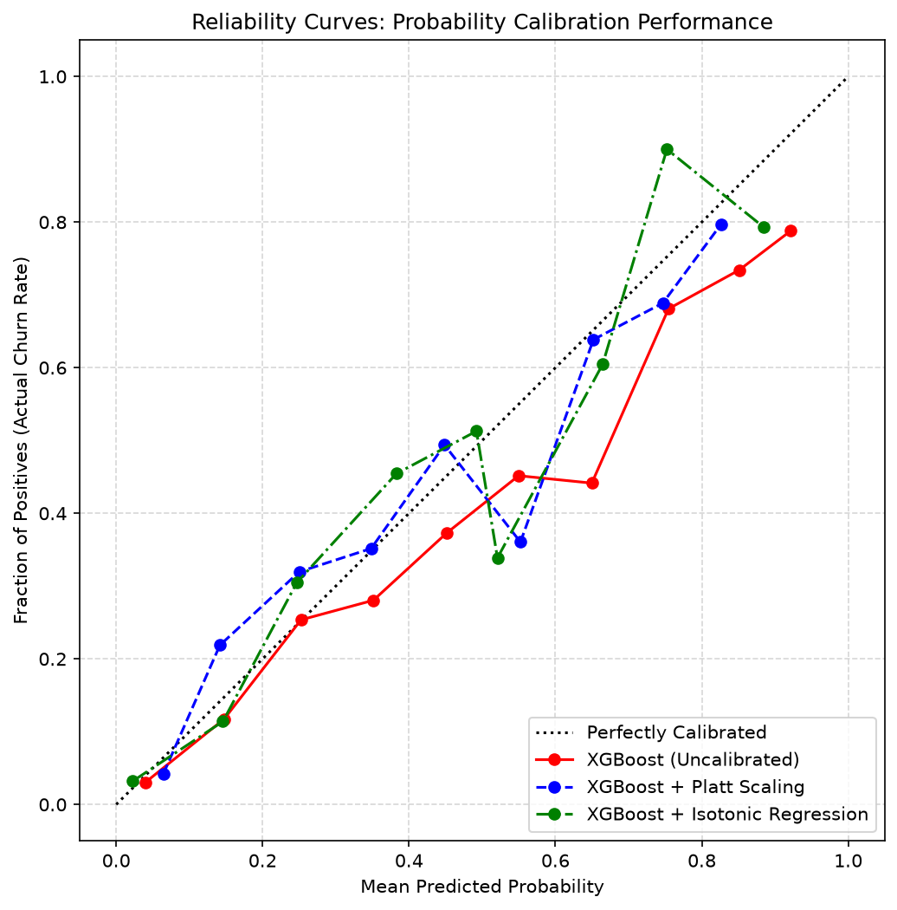
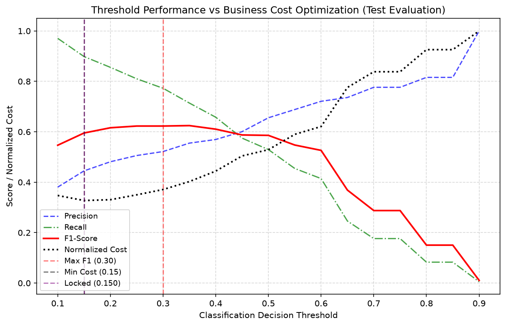
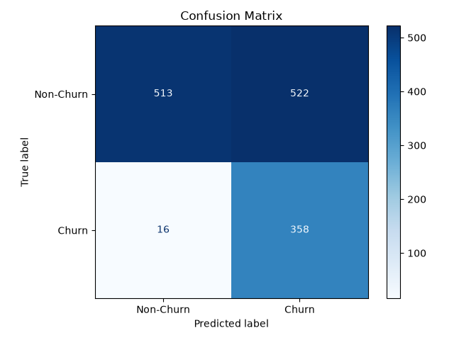

# RetainIQ — AI-Powered Customer Retention Intelligence Platform

[](https://www.python.org/)
[](https://fastapi.tiangolo.com/)
[](https://streamlit.io/)
[](https://www.postgresql.org/)
[](https://docs.pytest.org/)
[](https://www.docker.com/)

RetainIQ is a modular, end-to-end machine learning platform built to predict, analyze, and mitigate customer churn. The platform uses classification models trained on customer subscription data (IBM Telco Churn standard) and translates risk signals into actionable, prescriptive "Save Plays" to protect Monthly Recurring Revenue (MRR) and optimize customer success workflows.

---

## 📐 System Architecture & Data Flow

### 1. High-Level Component Topology


### 2. Asynchronous Cohort Ingestion Lifecycle


### 3. Machine Learning Preprocessing & Training Pipeline


### 4. Local Explainer & Save Plays Decision Flow


---

## ⚡ Key Feature Matrix

| Feature | Capabilities | Emojis |
| :--- | :--- | :---: |
| **Real-Time Inference API** | Dynamic single-customer risk scoring, classification, and segment mapping. | 🧠 |
| **Explainable AI (XAI)** | Core Local SHAP explanation engines isolating primary positive/negative churn forces. | 🔍 |
| **Asynchronous Ingestion** | Bulk drag-and-drop CSV processing using concurrency-safe threadpool workers. | ⚡ |
| **Prescriptive Save Plays** | Value-aware customer retention campaign suggestions mapped to unique risk profiles. | 🛡️ |
| **Executive Dashboard** | Real-time analytics, revenue risk trackers, segment cohorts, and cohort trends. | 📊 |
| **Data Telemetry & Drift** | Real-time telemetry monitoring input distribution shifts using Kolmogorov-Smirnov checks. | 📈 |

---

## 📂 Repository Structure

```text
ai-customer-retention-platform/
├── backend/                  # FastAPI Web Server Tier
│   ├── app/
│   │   ├── api/              # Routers, authentication hooks, and rate limiters
│   │   ├── core/             # Configuration managers, logging, and security
│   │   ├── database/         # SQLAlchemy ORM schemas and Alembic configurations
│   │   └── services/         # Core business logic (Inference, DB persistence, Ingestion)
│   └── tests/                # Pytest unit and integration test suite
├── frontend/                 # Streamlit UI Dashboard Tier
│   ├── app.py                # Analytical dashboard application router
│   ├── api_client.py         # Thread-safe REST API client
│   └── views/                # Cohorts, Predictions, Uploads, and Telemetry subviews
├── ml/                       # Machine Learning Engineering Tier
│   ├── notebooks/            # Exploratory Data Analysis and modeling sandboxes
│   ├── preprocessing/        # Pandas ETL, cleaning, engineering, and validators
│   ├── training/             # Ensemble fitters, calibrations, and metrics validations
│   └── artifacts/            # Serialized models, scalers, and metric assets
│       ├── artifacts_manifest.json  # Checksum validation signatures
│       ├── model.pkl         # Serialized Calibrated GBDT Ensemble
│       ├── pipeline.pkl      # Preprocessing ColumnTransformer
│       ├── encoders.pkl      # Categorical dictionaries map
│       └── model_metadata.pkl # Model training inputs and expected features list
├── configs/                  # Global YAML settings, features, and model constants
├── docker/                   # Nginx reverse proxy configs and docker compose files
└── data/                     # Ignored directory hosting raw and clean datasets
```

---

## 📊 Model Performance & Business Savings

By deploying the cost-sensitive decision theory model threshold sweep at `0.15` (balancing the asymmetric $5.0 cost of a False Churn Miss against the $1.0 cost of an Outreach Campaign), RetainIQ delivers a **67.4% reduction in churn-associated losses**:

### 1. Cost Optimization & Business Impact (Holdout Test Set)

| Metric | No Outreach (Baseline) | Standard Threshold (`0.528`) | Cost-Optimal Threshold (`0.15`) |
| :--- | :---: | :---: | :---: |
| **Recall (Churners Caught)** | 0.0% | 48.9% | **89.8%** (Catches ~90%) |
| **Operational Accuracy** | 73.5% | **80.0%** | 67.6% |
| **Total Churn Cost** | $1,870.0 | $1,046.0 | **$609.0** |
| **Net Financial Savings** | $0.0 | $824.0 | **$1,261.0** (**67.4% cost reduction**) |

### 2. Algorithm Performance Benchmarks

| Model Family | Operational Threshold | Holdout Accuracy | Holdout ROC-AUC | Holdout F1-Score |
| :--- | :---: | :---: | :---: | :---: |
| **Calibrated Ensemble (GBDT)** | `0.15` | 67.6% | **84.4%** | **0.595** (High Recall focus) |
| **Logistic Regression** | `0.528` | 75.7% | 84.4% | 0.624 |
| **AdaBoost** | `0.50` | 77.9% | 84.0% | 0.634 |
| **Gradient Boosting** | `0.528` | 78.5% | 84.2% | 0.607 |
| **XGBoost** | `0.528` | 78.6% | 82.5% | 0.584 |
| **LightGBM** | `0.528` | 78.7% | 83.3% | 0.576 |
| **Random Forest** | `0.528` | 77.4% | 81.2% | 0.545 |

---

## 🖼️ Model Evaluation Plots & Visualizations

The generated evaluation metrics are serialized inside the `ml/artifacts/plots/` directory:

* **Global Feature Importance (SHAP)**: Summarizes the top drivers (like contract type, monthly charges, and fiber optic subscriptions) pushing customers towards churn.
  
  
* **Probability Reliability Curve**: Visualizes model confidence calibration against actual frequencies.
  
  
* **Cost Optimization Sweep**: Plots total business costs across probability thresholds to identify the absolute savings minimum at `0.15`.
  
  
* **Holdout Confusion Matrix**: Captures model counts at the active operational threshold.
  

---

## 🚀 Local Quick-Start Guide

### Prerequisites
* **Python 3.10+** installed.
* **Git** installed.

### 1. Initialize virtual environment and install packages
Run the setup script from the project root directory. This script will automatically create a virtual environment, upgrade pip, and install all required packages:
```bash
# On Linux / macOS / Git Bash
./scripts/setup.sh
```

### 2. Configure Environment Variables
Copy `backend/.env.example` to `backend/.env` and replace `JWT_SECRET` with a secure random key:
```env
APP_NAME="RetainIQ API"
JWT_SECRET="your-secure-random-token-here"
```

### ⚙️ Environment Configuration Schema

| Variable | Description | Default | Requirements |
| :--- | :--- | :---: | :---: |
| `DATABASE_URL` | SQLAlchemy connection string target | `sqlite:///customer_retention.db` | Required |
| `JWT_SECRET` | Secret key used to sign client credentials tokens | *None* | Required |
| `APP_NAME` | Global application name match for pytest checks | `"RetainIQ API"` | Required |
| `DEBUG` | Enables verbose console printing | `False` | Optional |
| `LOG_LEVEL` | Logging filtering threshold (INFO, DEBUG, WARNING) | `INFO` | Optional |

### 3. Run Database Migrations
Initialize your local database schemas using Alembic migrations:
```bash
cd backend
# Activate virtual environment
source ../venv/Scripts/activate # Windows Git Bash
# source ../venv/bin/activate   # Linux/macOS

# Apply migrations
alembic upgrade head
```

### 4. Boot Up the Applications

#### Launch the FastAPI API Server:
```bash
# Inside the backend/ directory
uvicorn app.main:app --reload
```
* **API Documentation (Swagger)**: Open [http://localhost:8000/docs](http://localhost:8000/docs)
* **API Redoc**: Open [http://localhost:8000/redoc](http://localhost:8000/redoc)

#### Launch the Streamlit Dashboard:
```bash
# Navigate to the frontend/ directory in a separate terminal tab
source ../venv/Scripts/activate
streamlit run app.py
```
* **UI Interface**: Open [http://localhost:8501](http://localhost:8501)

---

## ⚡ Machine Learning Pipeline Execution

Developers can trigger preprocessing pipelines, hyperparameter tuning, segmentation model retraining, and statistics validations using these commands from the project root:

* **Ingestion ETL & Pipelines**: Re-run cleaning, feature scaling, SMOTE balance, and exports `pipeline.pkl`:
  ```bash
  python ml/preprocessing/pipeline.py
  ```
* **Autoencoder Training**: Retrains PyTorch compression networks to reduce continuous dimensions down to 16:
  ```bash
  python ml/segmentation/train_autoencoder.py
  ```
* **K-Means Clustering**: Clusters latent customer coordinates into risk cohorts and exports `kmeans_personas.md`:
  ```bash
  python ml/segmentation/kmeans.py
  ```
* **Calibrated Ensemble Retraining**: Fits XGBoost, LightGBM, GBDT, and Logistic Regression models and exports `model_ensemble.pkl`:
  ```bash
  python ml/training/ensemble.py
  ```
* **Cost Sweeps & Decision Threshold**: sweep probability threshold against False Negative/False Positive ratios:
  ```bash
  python ml/training/threshold.py
  ```
* **Inference Telemetry Drift**: Evaluates statistical drift on production logs database tables:
  ```bash
  python ml/training/model_monitor.py
  ```

---

## 🔌 API Endpoints Reference

| Method | Endpoint | Description | Auth Required | Rate Limit |
| :--- | :--- | :--- | :---: | :---: |
| `POST` | `/api/v1/auth/register` | User account registration | No | — |
| `POST` | `/api/v1/auth/login` | Credentials token generation (OAuth2) | No | 10 / min |
| `POST` | `/api/v1/upload` | Cohort CSV dataset async ingestion | Yes | 60 / min |
| `GET` | `/api/v1/uploads` | Ingestion status listing | Yes | — |
| `GET` | `/api/v1/customers` | Query paginated customer lists | Yes | — |
| `GET` | `/api/v1/customers/{id}/explain` | Compute local customer SHAP Save Plays | Yes | 60 / min |
| `GET` | `/api/v1/analytics/drift` | Get Kolmogorov-Smirnov feature drift statistics | Yes | — |
| `GET` | `/health` | In-memory server health check status | No | — |

---

## 🧪 Testing and Coverage Commands

Run the full testing framework locally to ensure system stability across endpoints and ML structures:
```bash
# From the project root folder
python -m pytest
```
* **Database Verification**: Asserts database engine cascades, `is_high_risk` constraints, and table relations.
* **API Validation**: Simulates Latin-1/UTF-8 file uploads, token validations, and endpoint authentication.
* **Calibration Verification**: Ensures Expected Calibration Error (ECE) calculations evaluate correctly.

---

## 🛡️ Telemetry, Security & Guardrails

* **Logging Filter (Redaction)**:
  An active regex-filter (`app/core/logging_config.py`) checks stdout streams and replaces credentials, charges, or user metrics with `[REDACTED]` to prevent printing sensitive information in logs.
* **Cryptography Integrity**:
  During server boot, the application reads the SHA-256 hashes of `pipeline.pkl`, `model.pkl`, `encoders.pkl`, and `model_metadata.pkl` inside `artifacts_manifest.json`. If a mismatch is detected, startup aborts with an `ArtifactValidationError` to prevent loading corrupted model files.
* **Thread-Safe Memory Sweepers**:
  API requests eviction loops clear old timestamps periodically (every 500 requests) inside the sliding-window rate-limiting middleware to prevent memory growth leaks in production.
* **SQLite Concurrency Lock Protection**:
  During local SQLite usage, write locks can block simultaneous queries. RetainIQ processes upload parsing tasks sequentially inside a background worker queue to avoid contention. PostgreSQL is used in staging/production to natively scale concurrent reads and writes.
* **Relational Database Cascades**:
  The persistence schema utilizes strict SQL relational cascades. Deleting any `Upload` record automatically cascades and purges all dependent customer profiles and prediction logs, maintaining DB integrity and clean storage.

---

## 🌍 Enterprise Hosting & Cloud Deployment

For information on multi-container deployments using local Docker Compose stacks, or instructions for hosting on a 100% free cloud tier (Render, Neon PostgreSQL, and Streamlit Community Cloud), read the **[DEPLOYMENT.md](file:///c:/Users/krish/Downloads/ai-customer-retention-platform/DEPLOYMENT.md)** guide.

---

## 📄 License
Distributed under the MIT License. See [LICENSE](LICENSE) for more details.