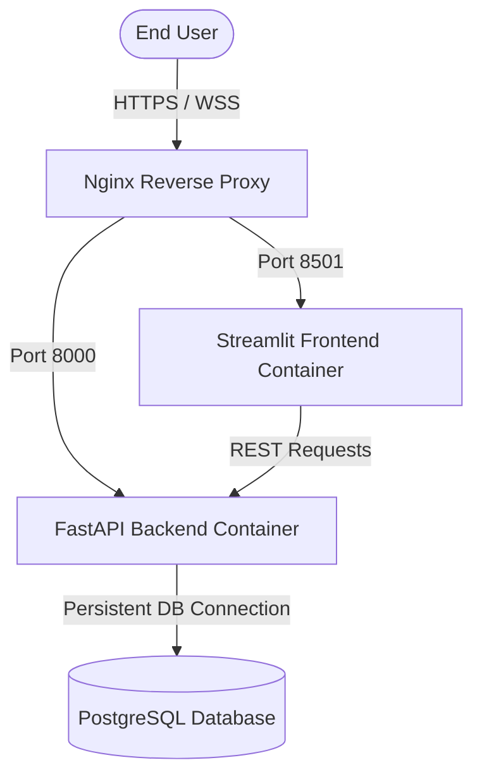

# RetainIQ System Architecture & Topology Guide

This guide covers the container architecture, database models, communication patterns, and machine learning pipelines powering the RetainIQ platform.

---

## Infrastructure Topology & Multi-Container Design

The application is structured into a multi-container Docker topology separating the API application server (FastAPI), the analytical web dashboard (Streamlit), a PostgreSQL database, and an Nginx reverse proxy.



### 1. Nginx Reverse Proxy (`nginx:alpine`)
- **Gateway Ingress:** Routes incoming web and API traffic from the host.
- **WebSocket Upgrades:** Manages WebSocket connections (`Upgrade` and `Connection` headers) required by Streamlit for interactive browser sync.
- **Access Control:** Restricts public visibility of internal database ports and admin endpoints.

### 2. Streamlit Frontend Dashboard
- **Analytical Portal:** Implements the dark-themed user dashboard using Streamlit and custom CSS.
- **Modular Views:** Structured into modular tab components inside `frontend/views/` (such as explorer views, simulation dials, and regression analysis plots).
- **Inference Client:** Calls [api_client.py](file:///c:/Users/krish/Downloads/ai-customer-retention-platform/frontend/api_client.py) to manage API requests.

### 3. FastAPI Backend Server
- **Async API Runtime:** Built using FastAPI to process high-concurrency requests asynchronously.
- **Request Guarding:** Enforces rate-limiting policies, decodes JWT login tokens, and filters out sensitive database columns.

### 4. PostgreSQL Database (`postgres:15-alpine`)
- **Persistence Layer:** Stores batch validation configurations, customer records, and prediction histories.
- **Connection Optimization:** Configured with active pooling parameters (`pool_size=20`, `max_overflow=10`, `pool_recycle=1800`) to prevent socket leaks under high loads.

---

## Machine Learning Pipeline Integration

The predictive engine is divided into distinct execution layers to prevent training-serving data leakage:

```text
ML Pipeline
├── Preprocessing Transformer (pipeline.pkl & encoders.pkl)
│   ├── Missing Values Imputer
│   ├── One-Hot Categorical Encoder
│   └── MinMax Numerical Scaler
│
├── Ensemble Predictive Model (model.pkl)
│   ├── LightGBM (Leaf-wise growth)
│   ├── CatBoost (Ordered boosting)
│   └── XGBoost (Regularized objective)
│
├── Probability Calibrator (Isotonic Regression)
│
└── Latent Coordinate Encoder (PyTorch Autoencoder)
```

### 1. Unified Predictor Ensemble
- **Model Combining:** Integrates predictions from gradient boosted classifiers (XGBoost, LightGBM, CatBoost) to ensure generalizability across customer cohorts.
- **Calibration Engine:** Normalizes unscaled classifier outputs using **Isotonic Regression** to map scores to true mathematical probabilities.

### 2. PyTorch Latent Autoencoder
- **Coordinate Compression:** Projects customer telemetry dimensions into a low-dimensional latent space.
- **Counterfactual Search:** The **Counterfactual Simulator** uses the trained decoder to solve for the minimal feature modifications needed to decrease churn risk to target levels.

### 3. Local & Global Explanations (SHAP)
- **Model Transparency:** Employs TreeSHAP explainers to calculate exact Shapley feature contribution values.
- **Driver Attribution:** Isolates the directional impact (positive or negative) of billing, contract types, and service add-ons on the overall risk calculation.
